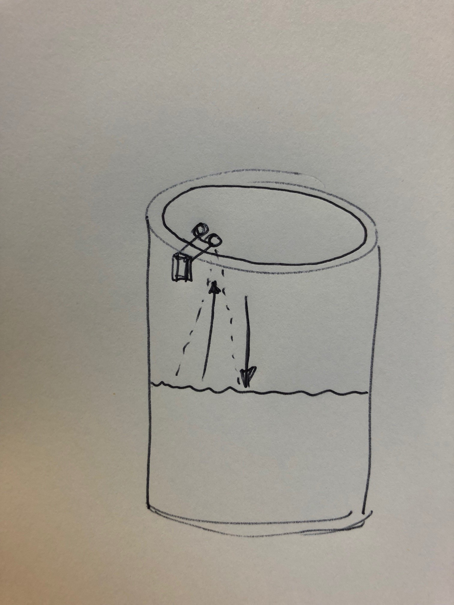
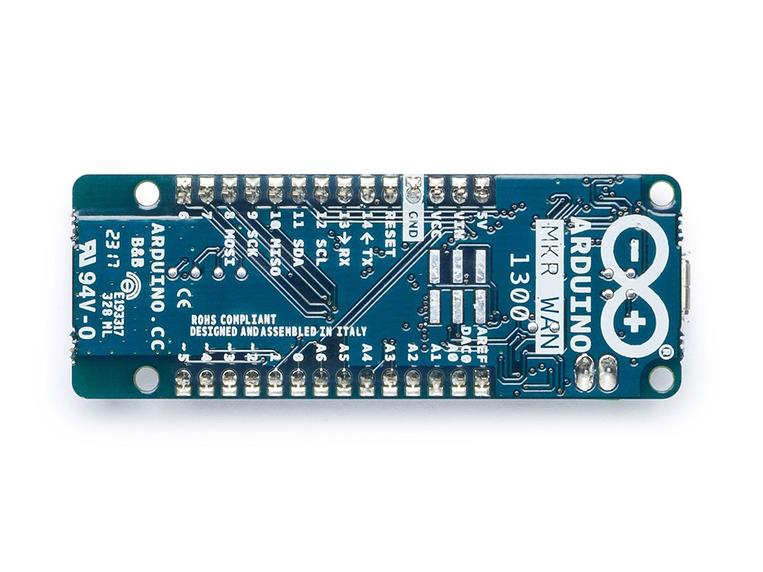
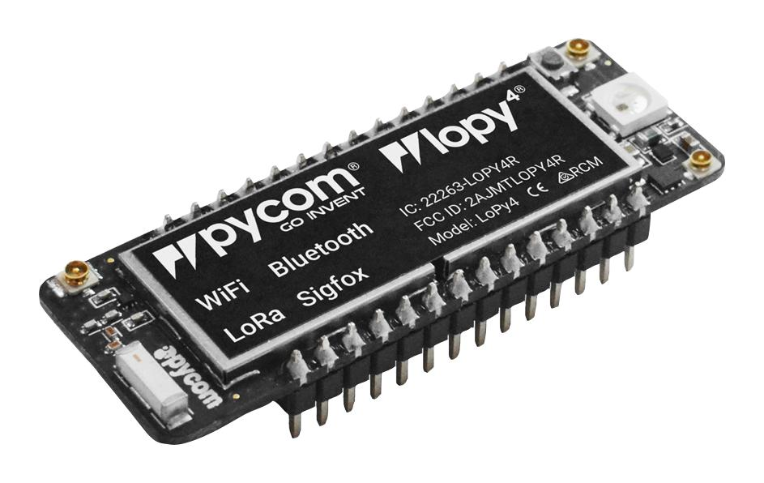

# Expertkompetens 
## Project report - The Beehive counter that changed to a water well meter

###### tags: `planning` `examination`
---
**Table of Contents**
> - [Idea](#idea) 
> - [Objectives](#objectives)
> - [Material](#material)
> - [Environment setup](#environment-setup)
> - [Putting everything together](#putting-everything-together)
> - [Platforms and infrastructure](#platforms-and-infrastructure)
> - [The code](#the-code)
> - [The physical network layer](#the-physical-network-layer)

## Idea
I started this project as a beehive counter planning to make some modifications on a already existing project called Easy Bee Counter found [here](https://github.com/hydronics2/2019-easy-bee-counter). Plan was to make it a little smaller then the original, use a [Pycom Lopy4](https://pycom.io/product/lopy4/) as main board  and  [LoRaWAN®](https://lora-alliance.org/about-lorawan/) as my communication protocol.

But sins I have problem getting all the required components in time I was forced to rethink and use what components I got at home. With that in mind I changed Idea to a measure water level in my old hand dug well.
The Idea is to use an Ultra Sonic Distance Sensor, HC-SR04. Make a box for it so I can Mount it just under the well lid and establish a “normal” water level distance.



After that I plan to trigger readings to keep track hon how much water I user in my well.
 I can then integrate these measures in my [Home Assistant](home-assistant.io) Controller to make automations based on water level ex. Stop watering my garden plants. 
I can also based on measures taken see how fast my well is refilled

## Objectives
- Register an account on [The Things Network](https://eu1.cloud.thethings.network/console)
- Figure out how to connect a Lopy4 to TTN Network and send measurements to the TTN MQTT gateway
- Recover the messages with Node-Red in on my local network and then send the values to my local Home Assistant installation.
- Build some automations based on values received.

## Material

>| Component | Type |Price | Vendor |
>| --------- | ---------------- | ------------- |---------------------|
>| [Pycom Lopy4](https://pycom.io/product/lopy4/)   | Microcontroller| 480 kr   |[Digikey](https://www.digikey.se/products/sv?keywords=lopy4)
>|[Pycom Expansion Board 3](https://www.digikey.se/product-detail/en/pycom-ltd/UNIVERSAL-EXPANSION-BOARD/1871-1004-ND/7721842)|Expansion Board|183 kr|[Digikey](https://www.digikey.se/product-detail/en/pycom-ltd/UNIVERSAL-EXPANSION-BOARD/1871-1004-ND/7721842)
>| [Arduino Antenn för GSM och LoRa](https://www.kjell.com/se/produkter/el-verktyg/arduino/arduino-tillbehor/arduino-antenn-for-gsm-och-lora-p87287)| Antenna |99.90 kr | [Kjell och Company](https://www.kjell.com/)
>|[Ultrasonic Distance Sensor - HC-SR04](https://www.sparkfun.com/products/15569)|Sensor|39 kr|[Sparkfun](https://www.sparkfun.com/products/15569)|
>|[3st motstånd 1Ω](https://www.kjell.com/se/produkter/el-verktyg/elektronik/komponentsatser/playknowlogy-sortiment-med-resistorer-600-pack-p90646)|Resistor| 0.60 kr|[Kjell och Company](https://www.kjell.com/)|


## Environment setup
I have used *[VSCode](https://code.visualstudio.com/)* with the *[Pymakr](https://docs.pycom.io/gettingstarted/software/vscode/)* plugin and the *[Pycom Expansion Board 3](https://docs.pycom.io/datasheets/expansionboards/expansion3/)* to be able to connect and program the microcontroller. Also *[node.js](https://nodejs.org/en/)* is a requiment for the plugin to work.

## Putting everything together


Sins the Pycom board is a 3.5V and [HC-SR04](https://www.sparkfun.com/products/15569) is a 5V sensor we need to have a USB cabel connected to the Pycom Board. We also need to step down the echo voltage from 5 to 3.3V there for the three 1k resistors.

## Platforms and infrastructure
The idea was to use [LoRaWAN®](https://lora-alliance.org/about-lorawan/) as the main communication protocol because of the low energy consumption and the long range communication. 
I looked in to 2 development boards 

[Arduino MKR1300] (https://store.arduino.cc/products/arduino-mkr-wan-1300-lora-connectivity)



and  

[Pycom Lopy4](https://pycom.io/product/lopy4/)



The final choice was to try out the Lopy4 for this project sins it was a litle cheeper and was easyer to get.
I also didn’t like to spend too much money on the component sins as a beekeeper I do have more than 5 hives, so component is a cost factor to be able to scale up. Sins the project changed to a Well water level meter its not that important anymore.

## The code
 Sins I'm a beginner at [Micropython](https://micropython.org) I did seek the internet for examples and code snippets and found a good tutorial at [core-electronics](https://core-electronics.com.au/tutorials/hc-sr04-ultrasonic-sensor-with-pycom-tutorial.html). All my code is based on there example with some small modifications.

First thing the code do is to initiate pins for the [HC-SR04](https://www.sparkfun.com/products/15569)
Then we try to connect to a [TTN Gateway](https://eu1.cloud.thethings.network/console)
Here I added some LED functions so I could see if my Lopy did get a connetion or not.
when connected read values from sensor. To filter out false readings we use the function distance_measure wish takes 10 individual measures and then use the function distance_median to get a good solid value.
Then send the measure to the TTN network.

```python=
# initialise Ultrasonic Sensor pins
echo = Pin(Pin.exp_board.G7, mode=Pin.IN) # Lopy4 specific: Pin('P20', mode=Pin.IN)
trigger = Pin(Pin.exp_board.G8, mode=Pin.OUT) # Lopy4 specific Pin('P21', mode=Pin.IN)
trigger(0)
```

```python=
# Function to take measurements
def distance_measure():
    # trigger pulse LOW for 2us (just in case)
    trigger(0)
    utime.sleep_us(2)
    # trigger HIGH for a 10us pulse
    trigger(1)
    utime.sleep_us(10)
    trigger(0)

    # wait for the rising edge of the echo then start timer
    while echo() == 0:
        pass
    start = utime.ticks_us()

    # wait for end of echo pulse then stop timer
    while echo() == 1:
        pass
    finish = utime.ticks_us()

    # pause for 20ms to prevent overlapping echos
    utime.sleep_ms(20)

    # calculate distance by using time difference between start and stop
    # speed of sound 340m/s or .034cm/us. Time * .034cm/us = Distance sound travelled there and back
    # divide by two for distance to object detected.
    distance = ((utime.ticks_diff(start, finish)) * .034)/2

    return distance

while True:
    print(distance_measure())
```


```python=
# To reduce errors we take ten readings and use the median
def distance_median():

    # initialise the list
    distance_samples = []
    # take 10 samples and append them into the list
    for count in range(10):
        distance_samples.append(int(distance_measure()))
    # sort the list
    distance_samples = sorted(distance_samples)
    # take the center list row value (median average)
    distance_median = distance_samples[int(len(distance_samples)/2)]
    # apply the function to scale to volts

    print(distance_samples)

    return int(distance_median)
```

```python=
 # Take distance measurment, turn the light blue when measuring
        pycom.rgbled(0x00007d)
        utime.sleep(1)
        distance = distance_median()
        pycom.rgbled(0x004600)

        print("Distance:  ", distance)
        # encode the packet, so that it's in BYTES (TTN friendly)
        # could be extended like this struct.pack('f', distance) + struct.pack('c',"example text")
        # 'h' packs it into a short, 'f' packs it into a float, must be decoded in TTN
        packet = ustruct.pack('h', distance)

        # send the prepared packet via LoRa
        s.send(packet)

        # example of unpacking a payload - unpack returns a sequence of
        #immutable objects (a list) and in this case the first object is the only object
        print ("Unpacked value is:", ustruct.unpack('h',packet)[0])

        # check for a downlink payload, up to 64 bytes
        rx_pkt = s.recv(64)

```
## The physical network layer

I do not have my own TTN Gateway but planned to use the one that [Wexnet](www.wexnet.se) is hosting on the water tank at their facility.
Distance from my well to that gateway is approximately 4,75 Km. The distance is the reason that I choose LoraWan. I Do have some problem getting the Lopy4 to register at the gateway wish I think is due to distance and a low-quality antenna. When unit has register there is no problem sending the values to the gateway.

## Visualisation and user interface

Picture

## Finalizing the design

Picture

## Conclusion
Due to the problem making the first connection to the gateway I do need to find some solution to that so I dont have problems after a power failure.
Outher then that it works as expected.


<!-- 
Show the final results of your project. Give your final thoughts on how you think the project went. What could have been done in an other way, or even better? Pictures are nice!

- [ ] Show final results of the project
- [ ] Pictures
- [ ] *Video presentation -->
---
